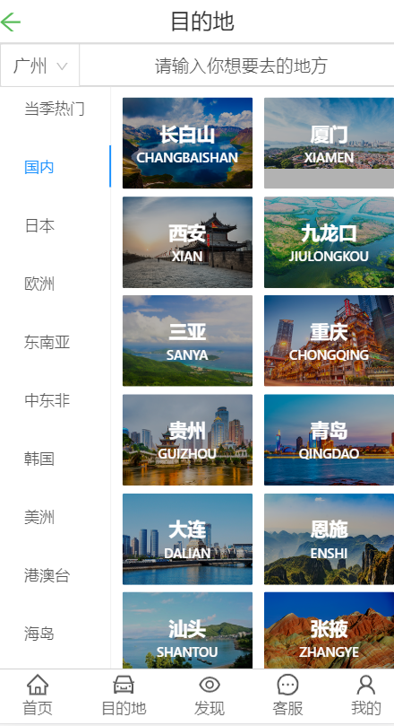

## 项目介绍

- 项目名称：   春秋旅游
  - 官网：       http://m.springtour.com/
  - 上线网址：   
    * webapp：http://47.105.164.196:1912/home
    * 后台管理系统：
  - git仓库地址 ：https://github.com/gzh51915/Spring-Autumn
- 团队与分工
  - 组长：温家鸿       
  - 成员：王灿辉，宋权库，方文涛
- 负责模块说明
      * 温家鸿：
          * 搭建项目脚手架、安装基本的插件
          * 利用antd的组件完成首页页面的数据渲染
          * 利用antd-ui框架完成列表页和二级列表的页面渲染和跳转功能
          * 编写路由的配置，利用react-route-dom实现底部导航栏跳转
          * 负责用nodejs搭建后台服务器，并且写好接口，
          * 完成注册登录页面的跳转及渲染
          * 项目上线
      * 方文涛：
          * 完成了“我的”页面的渲染
          * 完成了“发现”页面的渲染 
      * 宋权库：
          * 后台接口编写
          * 页面搭建
          * 实现删除功能
      * 王灿晖:
          * 登录注册
          * 实现增加编辑功能
- webapp页面
   * 
   * 
   * 
- webapp项目目录
    - src
        * components 组件文件
        * css        样式文件
        * image      图片文件
        * pages      页面文件
        * utils      工具文件
    - node_modules   模块文件
    - public         
    

