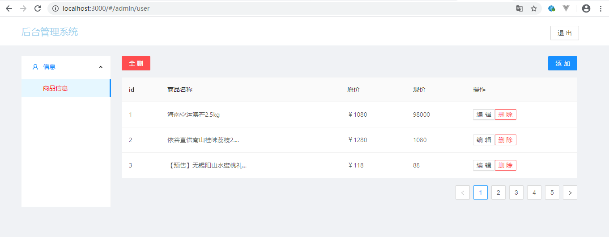
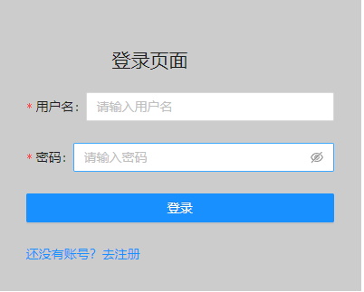
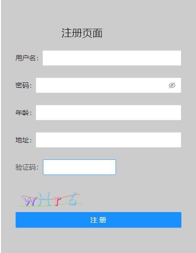
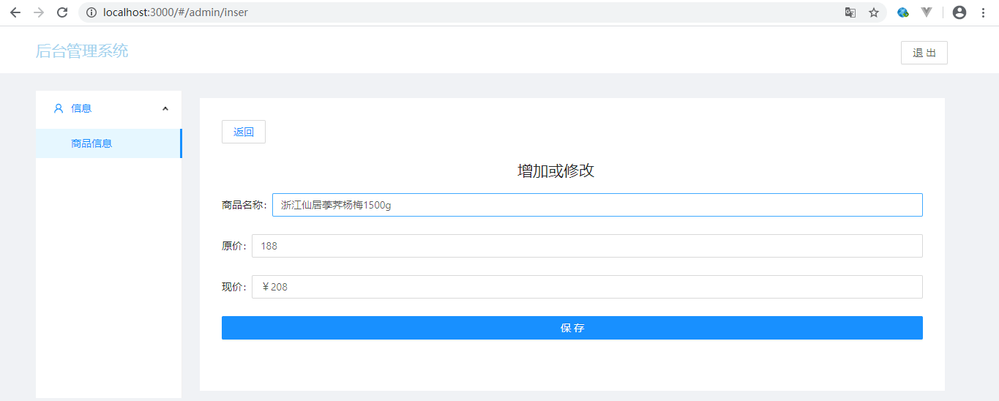

# 后台管理系统

* 成员：
   * 宋权库：后台接口编写,页面搭建，实现删除功能
   * 王灿晖:登录注册,实现增加编辑功能

### 页面
   * 
   * 
   * 
   * 

### 项目目录
* public
* server
     * db
        * index.js
     * router
        * goods.js
        * index.js
        * user.js
        * verifycode.js
* src
     * api
        * axios.js
        * index.js
     * img
     * page
        * inser
             * inser.js
             * insert.css
        * login
             * login.js
             * login.css
        * reg
             * reg.js
             * reg.css
        * admin.js
        * http.js
        * notFount.js
        * userInfor.js
     * util
        * commom.css
